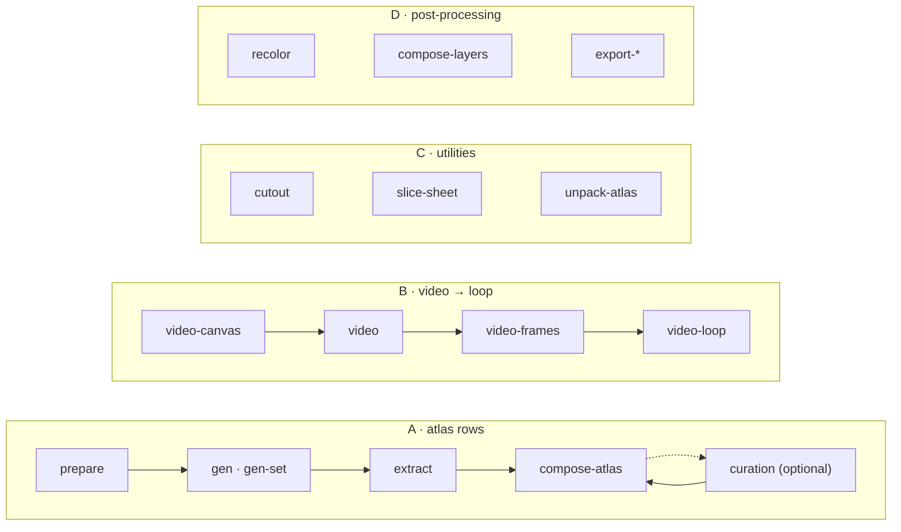

<h1 align="center">sprite-gen</h1>

<p align="center"><b>One drawing in. Game-ready sprites out — as an atlas, or as transparent motion loops.</b></p>

<p align="center">

**English** · [한국어](README.ko.md) · [日本語](README.ja.md) · [简体中文](README.zh-Hans.md) · [Español](README.es.md) · [Français](README.fr.md)

</p>

<p align="center">
  <a href="https://youtu.be/zVu9YlbPtog"></a>
</p>

<p align="center"><sub>Each character started as <b>one still image</b>. Grok Imagine brought it to life; sprite-gen extracted the transparent loops, and HyperFrames assembled this showcase.</sub></p>

---

Ask an image model for a "sprite sheet" and you know what you get: a character whose face changes every frame, a background that won't key out, poses that overlap and drift off-grid, and a PNG your game engine can't actually consume. Cute demo, useless asset.

`sprite-gen` is a Codex/Claude skill and a Python CLI that closes that gap. Give it **one base image** — it drives generation row by row, locks the character's identity, strips the chroma background to real alpha, extracts each pose as a clean transparent frame, and bakes a runtime atlas **with a machine-readable `manifest.json.frame_layout`**. Or hand the same still to a video model and get back a seamless, transparent loop per motion state. For the last 10% that generation never gets right, a **curation webview** lets you compare, reject, nudge and watch the loop live before you bake.

## Start with a request

Ask for **sprites** or **an image**. The agent checks access, asks only for missing provider/motion choices, runs the existing pipeline, and delivers the files. The curation view is optional. Save your choices once to reuse separate sprite and image defaults; a one-off request does not overwrite them. [User workflow and defaults](docs/user-workflow.md).

## Four pipelines, one CLI

Every verb works alone or as a pipeline stage. `sprite-gen --help` prints this same map, with every verb grouped by domain.



| Pipeline | What goes in → what comes out | Docs |
|---|---|---|
| **A · atlas rows** | one still + a list of states → `sprite-sheet-alpha.png` + `manifest.json.frame_layout`, with **Breathe** baked on idle poses | [run-contract](docs/run-contract.md) · [breathing](docs/breathing.md) |
| **B · video → loop** | one still → per state, a seamless transparent GIF / WebP / strip, animated by Grok Imagine and cut at its true period | [video-pipeline](docs/video-pipeline.md) · [video](docs/video.md) |
| **C · utilities** | an imported image or grid sheet → clean transparent cuts; a finished atlas → a curator-ready run | [sheet-slicing](docs/sheet-slicing.md) · [curation](docs/curation.md) |
| **D · post-processing** | a finished sheet → deterministic colourways, rig layer composites, Aseprite / Phaser / Flame exports | [recolor](docs/recolor.md) · [layer-tracks](docs/layer-tracks.md) · [engine-export](docs/engine-export.md) |

Full index: [`docs/README.md`](docs/README.md). Architecture with domain and pipeline diagrams: [`docs/architecture.md`](docs/architecture.md).

## What you actually get

- **A transparent sprite atlas** (`sprite-sheet-alpha.png`) — real alpha, no leftover chroma fringe, verified against white backgrounds ([why the extractor unmixes instead of peeling](docs/chroma-alpha.md)).
- **A runtime manifest** (`manifest.json.frame_layout`) — absolute frame rectangles, per-state fps and loop flags. Your engine samples rectangles; it never guesses a grid.
- **Breathe** — a still idle becomes a living loop, deterministic squash & stretch baked on your curated frames from one sidecar field, anatomy-aware and pixel-true ([details](docs/breathing.md)).
- **Pixel-art that stays on grid** — the Backbone Lattice measures one grid for the whole subject and holds every cut to it ([details](docs/pixel-unfake.md)).
- **Motion loops from video** — jumps get a tall canvas, attacks a wide one, the loop point is the clip's own period, and a one-shot action is cut rest → action → rest ([details](docs/video-pipeline.md)).
- **Deterministic colourways** — `recolor` bakes N variant sheets from a palette map; same input, same output bytes ([details](docs/recolor.md)).
- **QA you can watch** — per-state GIFs and contact sheets, so motion is judged as motion before anything ships. Cyclic locomotion (walk/run) stays experimental unless motion QA actually passes.

## Quickstart

```bash
# install (Pillow, NumPy) into a fresh virtualenv — the venv is the only supported interpreter
python3 -m venv .venv && source .venv/bin/activate
pip install -e .
sprite-gen --help
```

**A · atlas rows** — one still to a runtime atlas.

```bash
sprite-gen prepare --out-dir <run> --character-id <id> --base-image base.png   # request, guides, prompts
sprite-gen gen-set --run-dir <run> --provider codex                            # every state row, 4 at a time
sprite-gen extract --run-dir <run>                                             # chroma → transparent frames
sprite-gen compose-atlas --run-dir <run>                                       # sprite-sheet-alpha.png + manifest.json
sprite-gen curation --run-dir <run>                                            # (optional) pick, nudge, breathe
```

**B · video → loop** — one still to transparent loops (needs `ffmpeg`, `img2webp`, and your own `grok` login or `XAI_API_KEY`).

```bash
sprite-gen video-set --base side=still.png --states idle,walk,run,jump,attack --out-dir set/
# per item: video-canvas → video → video-frames → video-loop; set/table.md names every result
```

**C · utilities** — each stands alone.

```bash
sprite-gen cutout icon.png --white-check              # white/ivory → matte, magenta/green → chroma engine
sprite-gen slice-sheet --sheet sheet.png --chroma-key magenta --grid 3x2   # multi-figure sheet → per-cell cuts
sprite-gen unpack-atlas --atlas sheet.png             # finished atlas → curator-ready run (or --pngs-dir folder/)
```

**D · post-processing** — refine a finished sheet without regenerating.

```bash
sprite-gen recolor-palette --base <run>/sprite-sheet-alpha.png --out palette.draft.json
sprite-gen recolor --run-dir <run> --spec recolor.spec.json      # → <run>/variants/
sprite-gen compose-layers --run-dir <run>                        # rig runs: declared stacks → <run>/layers/
sprite-gen export-aseprite --run-dir <run>                       # Aseprite JSON for Phaser / Flame
```

The agent-facing workflow, gates and contracts live in [`SKILL.md`](SKILL.md).

## Install as a skill

```bash
python3 ~/.codex/skills/.system/skill-installer/scripts/install-skill-from-github.py \
  --repo aldegad/sprite-gen --path . --name sprite-gen
```

Image generation is part of this engine (`sprite_gen.gen`, providers `codex` and `grok`; the general `image-gen` skill is a thin shuttle over it). Video uses **your own** credential — the `grok` CLI login or an `XAI_API_KEY` — and nothing is shipped with the repo ([docs/video.md](docs/video.md)).

`sprite-gen` supports CPython 3.10+; CI runs 3.10 and 3.14. The quickstart needs a Python with working `venv`/`ensurepip`.

## Attribution

The component-row workflow is inspired by the Apache-2.0 licensed `hatch-pet` skill, but targets generic game sprite atlases and includes no pet packages or pet visual assets.

Community contributions, experiments, and their originating pull requests are documented in [`CONTRIBUTORS.md`](CONTRIBUTORS.md).

## License

Apache-2.0
