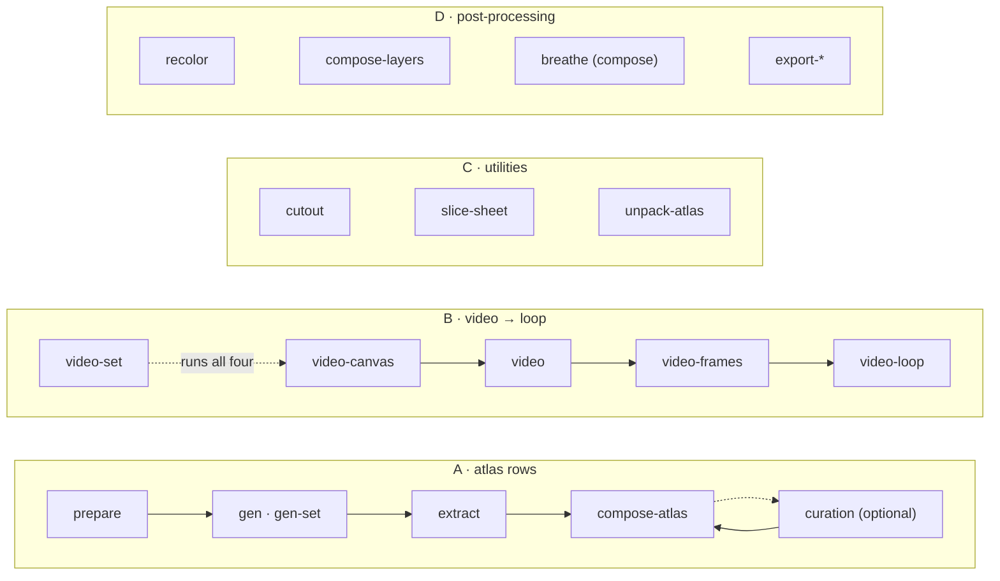

# sprite-gen documentation index

One tool, four pipelines, one taxonomy. Every verb works alone or as a pipeline stage;
every doc below owns exactly one concern and the others point at it. Start with the
pipeline you are running, then follow its contract doc.

| Pipeline | Entry doc | Verbs |
|---|---|---|
| **A · atlas rows** — one still becomes a runtime sprite sheet | [run-contract.md](run-contract.md) | `prepare` → `gen` / `gen-set` → `extract` → `compose-atlas`; optional `curation` and recompose |
| **B · video → loop** — one still becomes transparent motion loops | [video-pipeline.md](video-pipeline.md) | `video-canvas` → `video` → `video-frames` → `video-loop`, `video-set` |
| **C · utilities** — imported images in, clean cuts out | [sheet-slicing.md](sheet-slicing.md) | `cutout`, `slice-sheet`, `unpack-atlas` |
| **D · post-processing** — finished sheets, refined | [recolor.md](recolor.md) | `recolor`, `recolor-palette`, `compose-layers`, breathing (compose), `export-pngs`, `export-aseprite` |

`sprite-gen --help` prints the same four pipelines and every verb grouped by domain; the
grouping is derived from `sprite_gen/_modules.py`, the one taxonomy table.

## User requests

| Doc | Owns |
|---|---|
| [user-workflow.md](user-workflow.md) | Two conversation flows, access checks, optional curation and saved defaults |
| [atlas-workflow.md](atlas-workflow.md) | Execution of GPT row sprites through the existing extraction pipeline |

## Contract & structure

| Doc | Owns |
|---|---|
| [run-contract.md](run-contract.md) | The atlas pipeline's normative contract: stages, the run-dir folder tree, curation-view display, atomic extract, concurrency scope |
| [architecture.md](architecture.md) | How the code is laid out: domains, stage ownership, the numeric SSoT, the cell model, extraction internals, runtime manifest |

## Request authoring (pipeline A inputs)

| Doc | Owns |
|---|---|
| [states-and-frames.md](states-and-frames.md) | Which states to request and how many frames each |
| [subject-profiles.md](subject-profiles.md) | `character` vs `effect` subjects and the sparse-frame floor they set |
| [pixel-unfake.md](pixel-unfake.md) | The `fit` / `pixel_unfake` path for pixel-art targets and jitter-free locomotion |
| [chroma-alpha.md](chroma-alpha.md) | Choosing the chroma key and diagnosing alpha cleanup after extraction |

## Generation (the AI steps)

| Doc | Owns |
|---|---|
| [gen.md](gen.md) | `sprite-gen gen` / `gen-set`: providers, default resolution, transparency strategy per provider, row usage |
| [video.md](video.md) | `sprite-gen video`: image to mp4 through Grok Imagine with the user's own credential |
| [video-pipeline.md](video-pipeline.md) | Pipeline B engine contract: state canvas, keyed frames, true-period and one-shot cycles, strip/GIF/WebP, the batch |
| [frame-interpolation.md](frame-interpolation.md) | Generative in-betweens for sprite frames, recorded as a take |
| [seamless-video-loop.md](seamless-video-loop.md) | Making a non-looping ambient clip loop forever (RIFE seam bridge) — a different job from pipeline B |

## Curation

| Doc | Owns |
|---|---|
| [curation.md](curation.md) | The webview, standalone candidate view, finished-sheet editing and every `curation.json` field |
| [breathing.md](breathing.md) | The idle-breathing post-process layer and the static-pose row recipe |
| [locomotion-curation.md](locomotion-curation.md) | Manual selected cycles, clean GIF export |

## Post-processing (pipeline D)

| Doc | Owns |
|---|---|
| [recolor.md](recolor.md) | Deterministic palette-swap bake, colourway pick, `variants/` and its report |
| [layer-tracks.md](layer-tracks.md) | Rig runs: `rig` / `track` / `layers` contract and `compose-layers` |
| [engine-export.md](engine-export.md) | Aseprite-compatible export for Phaser and Flame |

## Specialized inputs (pipeline C and direction runs)

| Doc | Owns |
|---|---|
| [directional-anchor-workflow.md](directional-anchor-workflow.md) | Directional / 45° rows: base → direction anchors → rows, the left-right gate |
| [sheet-slicing.md](sheet-slicing.md) | Multi-figure grid sheets to per-cell standing cuts; the `cutout` routes |

## QA

| Doc | Owns |
|---|---|
| [qa-motion.md](qa-motion.md) | Motion Continuity — the blocking judgement of a row as motion |

## Runtime & process

| Doc | Owns |
|---|---|
| [interpreter.md](interpreter.md) | Why the project venv is the only interpreter (no global `python3`, no NumPy fallback) |
| [rename-gate.md](rename-gate.md) | What must move together when a vocabulary word or key is renamed |
| [troubleshooting.md](troubleshooting.md) | Symptoms of a pipeline that is "quietly wrong", with causes and fixes |
